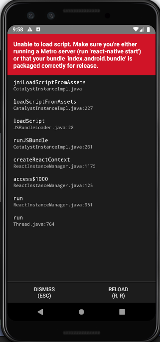
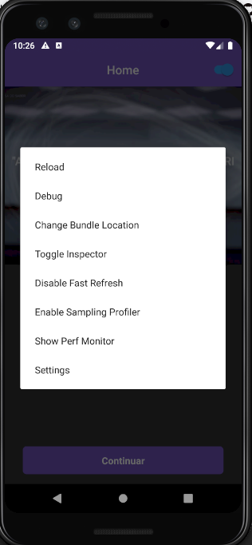

# Video Player App

An app to display videos with the same base functionallities from Youtube.

## Execute this project

Before trying to run this, there are somethings I'd like to draw your attention to. This app was tested **ONLY ON ANDROID** and **NOT ON IOS**. So, if you try to run it on a iOS environment, maybe you'll get some errors from libraries you'd have to install. This was just a reminder before you try to run the app on iOS & it crashes xD.

### Video Files configuration

In order for the app to work, you'll need to download the videos directlly on the project. Yeah, I know this is not a good start to get this going, but I got some internet issues when trying to run the videos straight from the urls. As reported in [this issue](https://github.com/react-native-community/react-native-video/issues/1675), I also had this trouble when trying to run the videos on Android. Perhaps it's because the videos are too heavy or sth. Idk really, I tried hard to make it work, but as soon as I downloaded the videos and put the files references as the video's source, it worked fine. I also couldn't upload the videos to git since I'm limited to 100mb per file :c

So, unfortunetally this is the only way I thought to make it run for you.

There are 3 videos:

- https://d1rfq3h2na8ms8.cloudfront.net/editorial/2018/12-11/Rn8KKQBy-medium.mp4 : `src/videos/first.mp4`
- https://d1rfq3h2na8ms8.cloudfront.net/editorial/2018/12-11/X4W11rnR-medium.mp4 : `src/videos/second.mp4`
- https://d1rfq3h2na8ms8.cloudfront.net/editorial/2018/12-11/zB9GG6dV-medium.mp4 : `src/videos/third.mp4`

Ok, as you might've imagined, what you need to do is open each video url on your browser and download each one of them. After downloading the videos, **paste them on the same path I wrote above** respectively. So, inside `src/videos` you'll move the downloaded files with the corresponding link with the names `first.mp4`... and so on.

This is required because the code actually read those files with these names, so that's why you can't misspell them.

### Installation

It's crucial you have Node installed on your machine. If you already got it, then follow these steps:

```
$ cd project_folder
$ yarn
$ react-native run-android
```

**Important**: You should have your emulator or device connect in order for the `react-native run-android` to work.

Once you've ran the commands above, you're likelly to get a screen page on your device.



This is due to not having started bundle server. Just run `react-native-start` and you are good to go!

**Obs:** After running `react-native-start` and try openning the app, maybe you'll see just a blank screen and nothing else. Open the dev tools menu (ctrl + M or pressing "D" on the terminal) and press the "debug" option. This will open the remote debugger from react-native. The screen will still be blank with a message "connecting to debugger" on top. All you need to do is a cold start: close & kill the application from your device, and try to open it again. This happened to me and I had to follow these steps to make it work.



If you've managed to follow the steps correctly, you should get the app up and running now!

## Stack (techs used)

- Styled components
- React Hooks
- Husky (automate commit messages)
- Commitzen (CLI to help writing a good commit message)
- React
- React Context API
- React Navigation (new api v.5)
- Youtube seek functionallity (not a tech, but a cool feature anyway imo)

## Demo


